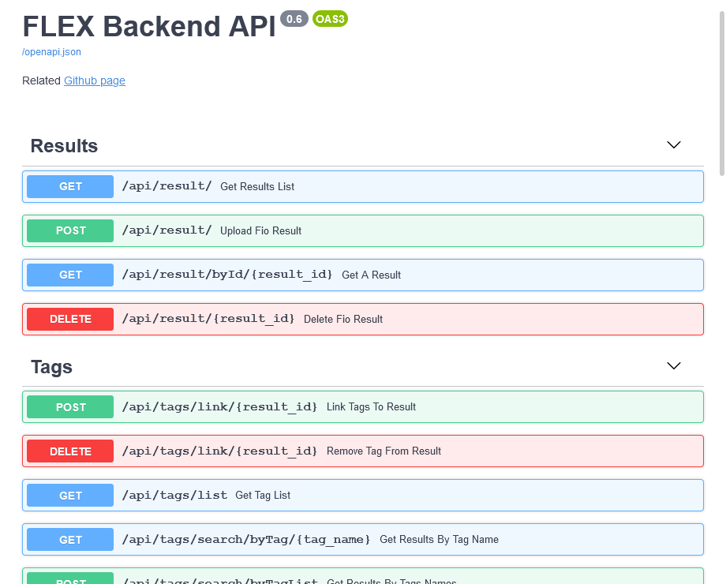

<!-- Logo -->
<p align="center">
  <a href="https://github.com/IMT-Atlantique-FIP2021/fiowebviewer-backend/">
    
  </a>
</p>

<!-- Name -->
<h1 align="center">
  <a href="https://github.com/IMT-Atlantique-FIP2021/fiowebviewer-backend/"><b>FLEX</b> Flexible I/O Explorer</a>
  </br>
  <i>Backend repository</i>
</h1>

[][WS_FASTAPI]
[](https://github.com/pre-commit/pre-commit)
[](https://github.com/psf/black)

## Screenshots



## Development environment setup

- Install required python3 module
- Create virtual env.
- Enable venv

```shell
$ sudo apt-get install python3 python3-venv
$ python3 -m venv venv
$ source venv/bin/activate
```

- Install python virual environment (cf. Getting started), then add dev. dependencies:

```shell
$ pip install -r requirements.txt -r requirements-dev.txt
```

- Install pre-commit hook

```shell
$ pre-commit install
```

- Start docker dev. env.

```shell
$ docker-compose -f docker-compose.dev.yml up -d
```

- Create local .env file and an empty build directory

```shell
$ cp .env.sample .env
```

- Start uvicorn in auto-reload mode

```shell
$ uvicorn --host 0.0.0.0 --port 8080 --env-file .env --reload --debug --app-dir backend/ main:app
```

## Production environment usage

> TODO... (*docker related*)

## Notes

- https://docs.python.org/3/tutorial/modules.html

<!-- URL Index -->

[WS_FASTAPI]: https://fastapi.tiangolo.com/
